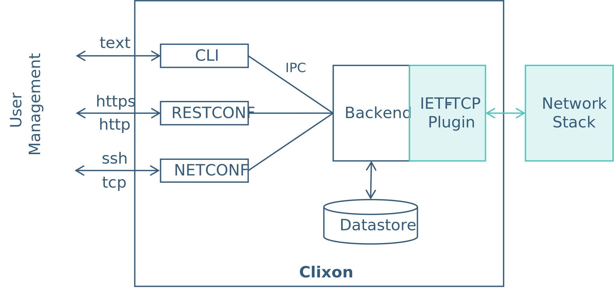

# TCP Plugin QNX

This folder contains the IETF TCP plugin prototype for the QNX operating system.

The implementation is based on the YANG-based configuration manager [Clixon](https://github.com/clicon/clixon).

## Architecture

Clixon is a management framework that can be used by network devices and other computer systems. It consists of a backend daemon with configuration data stores, a set of internal clients (cli, restconf and netconf) and (multiple) plugins which implement the system interactions specified in YANG models.

The backend manages a configuration data store and provides appropriate transaction mechanism. The clients provide interfaces to the external user and communicate with the backend via the inter-process communication (IPC) bus.

The system interaction with the base system, which is modeled in a YANG model, is handled by plugins. These can be written in C or C++ and use the Clixon API and a set of plugin callbacks.

The prototype plugin for the new IETF TCP YANG model interacts with the network stack of the target system as shown in the next figure.



## Build & Configure TCP plugin prototype

- Create the required folder structure for the TCP plugin (optional)

    ```
    mkdir -p /usr/local/var/clixon-plugin-tcp && chown -R <your user> /usr/local/var/clixon-plugin-tcp
    ```

- Copy the required YANG models of the TCP YANG model into a folder

- Configure path entries in [`plugin_config.xml`](plugin_config.xml) to adapt to the system configuration

    - General

        ```xml
        <!-- Process-id file of backend daemon -->
        <CLICON_BACKEND_PIDFILE>/your/tcp/plugin/location/example.pidfile</CLICON_BACKEND_PIDFILE>
        ```

    - Plugin Directories

        ```xml
        <!-- Location of backend .so plugins. Load all .so plugins in this dir as backend plugins -->
        <CLICON_BACKEND_DIR>/your/tcp/plugin/location</CLICON_BACKEND_DIR>
        ```

    - YANG

        ```xml
        <!-- A list of directories (yang dir path) where Clixon searches for module and submodules. -->
        <CLICON_YANG_DIR>/your/yang/models/location</CLICON_YANG_DIR>
        ```

    - CLI

        ```xml
        <!-- Directory containing frontend cli loadable plugins. Load all .so plugins in this directory as CLI object plugins.  -->
        <CLICON_CLI_DIR>/your/tcp/plugin/location</CLICON_CLI_DIR>

        <!-- Directory containing frontend cligen spec files. Load all .cli files in this directory as CLI specificationfiles.  -->
        <CLICON_CLISPEC_DIR>/your/tcp/plugin/location</CLICON_CLISPEC_DIR>
        ```

    - Sockets

        ```xml
        <!-- If family above is AF_UNIX: Unix socket for communicating with clixon_backend. -->
        <CLICON_SOCK>/your/tcp/plugin/location/example.sock</CLICON_SOCK>
        ```

    - Datastores

        ```xml
        <!-- The mandatory CLICON_XMLDB_DIR option determines where the datastores are placed -->
        <CLICON_XMLDB_DIR>/your/tcp/plugin/location</CLICON_XMLDB_DIR>
        ```

## Further Information

- [Clixon Documentation](https://clixon-docs.readthedocs.io/en/latest/index.html#)
- [IETF TCP Plugin](https://datatracker.ietf.org/doc/html/draft-ietf-tcpm-yang-tcp)
- [TCP Plugin](../Forschungskolloquium_SimonBauer_MartinMager_ProfScharf.pdf)
- [QNX Neutrino RTOS](https://blackberry.qnx.com/en/software-solutions/embedded-software/qnx-neutrino-rtos)
